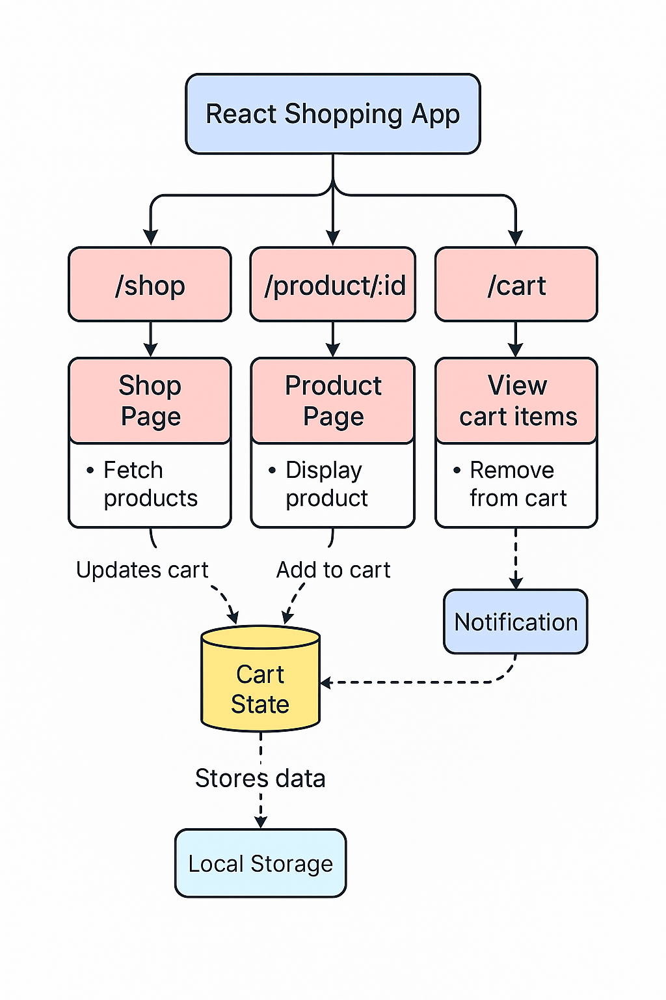
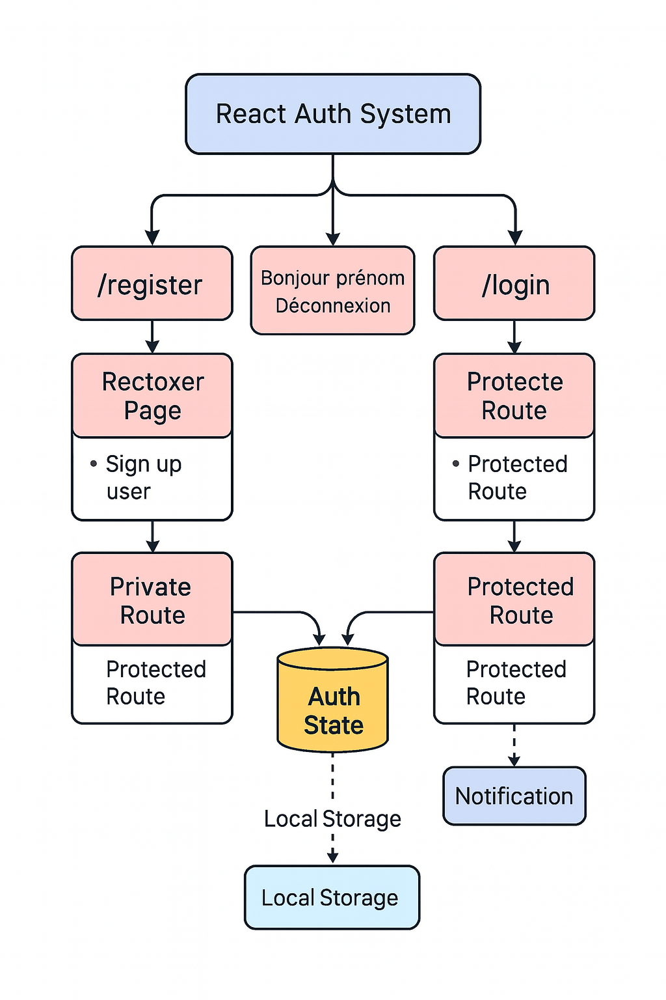

# Architecture de l'application

L’application s’articule autour de **React** pour l’interface et de
**Supabase** pour la base de données, l’authentification et le stockage
des images.

## Vue d’ensemble



1. L’utilisateur navigue sur le front React.
2. Les requêtes partent directement vers Supabase grâce à son client JS.
3. Les images des produits vivent dans Supabase Storage.
4. Les règles RLS de Supabase filtrent les accès.

## Authentification



- Comptes gérés par Supabase Auth.
- Le jeton de session (JWT) reste côté navigateur pour les appels sécurisés.

Ce choix limite la quantité de code serveur et facilite le déploiement sur
une plateforme statique comme Vercel.

## Structure du projet

```plaintext
E-Commerce/
├── client/           # Frontend React
│   └── src/          # composants, pages et hooks
├── Database/         # scripts SQL
└── Docs/             # documentation
```

### Stack technique

| Couche      | Outil                        |
|-------------|------------------------------|
| Frontend    | React, Vite, Tailwind        |
| Backend     | Supabase (API + Auth)        |
| Base de données | Supabase PostgreSQL     |
| Stockage    | Supabase Storage             |
| Paiement    | Stripe                       |
| Déploiement | Vercel                       |
